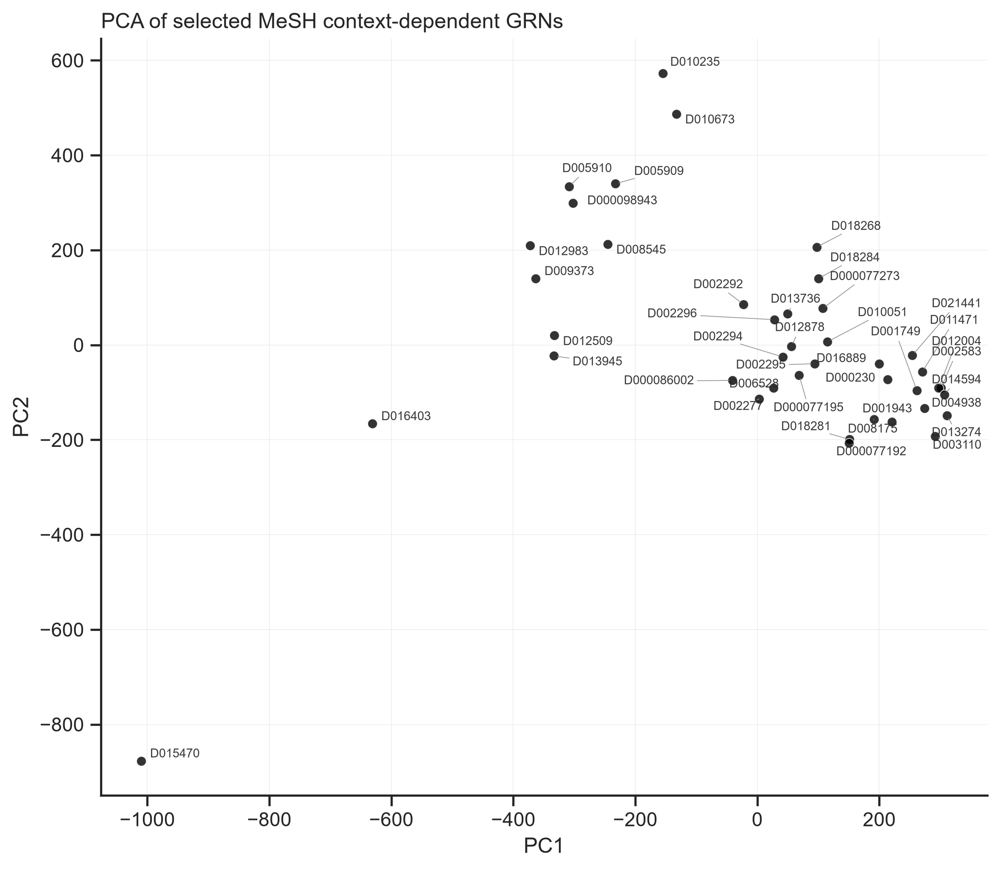
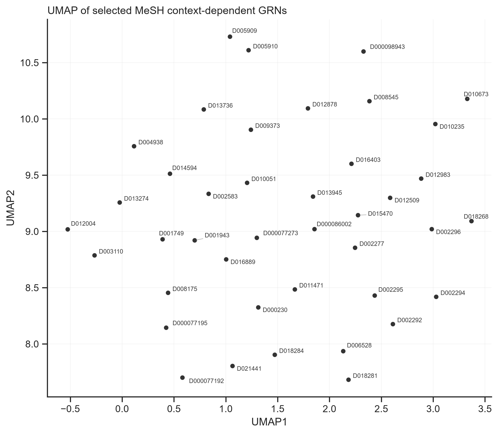

# Disease Gene Network Analysis

Reproducible workflows for disease-context gene network analysis, including literature-derived GRN reconstruction, TCGA cancer mapping, DESeq2 differential expression analysis, PageRank gene prioritization, and PCA/UMAP network comparison.

This repository collects analysis work from a summer research project in the Cell Systems Laboratory at Osaka University. The project explores how disease-specific gene regulatory networks can be reconstructed from biomedical literature and compared with cancer transcriptomic data. The broader motivation is drug discovery: disease-aware gene networks can help prioritize genes, compare disease contexts, and identify biologically meaningful regulatory signals beyond generic gene lists.

## What This Project Shows

- Reproduced single-disease context-dependent GRN construction from the published workflow.
- Built a curated mapping between TCGA cancer projects and MeSH disease descriptors.
- Computed tumor-vs-normal differential expression results for TCGA projects with sufficient normal samples.
- Reconstructed or extracted disease-specific GRN matrices for TCGA-mapped MeSH disease terms.
- Ranked genes by network importance using the Fig. 3 PageRank-style workflow.
- Compared disease network profiles with PCA and UMAP.

## Repository Structure

```text
data/
  TCGA_MeSH_Mapping_Input_Bokang_Shi.xlsx

scripts/
  compute_tcga_deseq2.R
  extract_tcga_mesh_grns.py
  convert_tcga_mesh_pmid_bert_to_log1p_cpm.py
  rank_mesh_grns_fig3_workflow.py
  plot_mesh_grn_pca_umap_fig3_workflow.py
  prepare_tcga_sample_availability_table.py
  compare_plasmacytoma_grn.py

results/
  tcga_degs/
  tcga_mesh/
  single_disease_reproduction/

figures/
  PCA and UMAP plots for TCGA-mapped disease networks

reports/
  PDF and Markdown reports documenting the analyses
```

Large raw data files are intentionally not committed. This includes GDC RNA-seq count downloads, large all-disease GRN matrices, intermediate Parquet matrices, and temporary rendering/build outputs.

## Workflow Overview

1. **Single-disease reproduction**
   - Adapted the original Fig. 3 context-dependent GRN workflow to individual MeSH disease terms.
   - Reproduced analyses for plasmacytoma (`D010954`) and hormone-dependent neoplasms (`D009376`).
   - Compared context-dependent networks against a universal context-independent background network.

2. **TCGA differential expression**
   - Queried GDC STAR count data with `TCGAbiolinks`.
   - Ran DESeq2 tumor-vs-normal analysis where at least two tumor and two normal samples were available.
   - Completed 23 TCGA cancer projects and skipped 10 with insufficient or unavailable TCGA normal samples.

3. **TCGA-to-disease network mapping**
   - Curated TCGA cancer type mappings to MeSH descriptors.
   - Retained composite mappings where anatomical site and histology both mattered.
   - Generated a 41-disease TCGA-mapped GRN panel.

4. **Network ranking and visualization**
   - Combined 15 released Zenodo GRNs with 26 reconstructed missing-MeSH GRNs.
   - Built a combined matrix covering 891,603 gene-pair rows and 41 MeSH disease terms.
   - Retained 668,903 nonzero relation rows for PCA/UMAP comparison.
   - Ranked genes in each disease network using the Fig. 3 PageRank-style procedure.

## Selected Results

The TCGA-mapped network panel includes 41 MeSH disease terms. The final combined matrix summary is available in:

```text
results/tcga_mesh/tcga_selected_mesh_log1p_CPM_combined_summary.csv
```

The top 100 PageRank-ranked genes per MeSH disease term are available in:

```text
results/tcga_mesh/tcga_selected_mesh_fig3_pagerank_top100.csv
```

The PCA and UMAP plots below show exploratory similarity among TCGA-mapped literature-derived disease networks.





## Reproducing The Analyses

Install Python dependencies:

```bash
python -m pip install -r requirements.txt
```

Install R dependencies for TCGA DEG analysis:

```r
install.packages("BiocManager")
BiocManager::install(c("DESeq2", "TCGAbiolinks", "SummarizedExperiment"))
```

Run TCGA DEG analysis:

```bash
Rscript scripts/compute_tcga_deseq2.R \
  --projects-csv results/tcga_degs/tcga_projects.csv \
  --output-dir outputs/tcga_degs \
  --gdc-data-dir data/gdc
```

Convert selected MeSH PubMedBERT scores into Fig. 3-style log1p-CPM GRN matrices:

```bash
python scripts/convert_tcga_mesh_pmid_bert_to_log1p_cpm.py \
  --mapping data/TCGA_MeSH_Mapping_Input_Bokang_Shi.xlsx \
  --availability No \
  --relations path/to/all_human_gene_interactions_2024-12-18.csv \
  --missing-pmid-bert path/to/Missing_MeSH_diseases_pmid_bert_corrs.parquet \
  --output outputs/tcga_mesh_log1p_cpm/tcga_available_in_zenodo_no_from_missing_mesh_pmid_bert_log1p_CPM.parquet \
  --summary-output outputs/tcga_mesh_log1p_cpm/tcga_available_in_zenodo_no_from_missing_mesh_pmid_bert_summary.csv
```

Rank genes for each selected MeSH GRN:

```bash
python scripts/rank_mesh_grns_fig3_workflow.py \
  --matrix outputs/tcga_mesh_rankings/tcga_selected_mesh_log1p_CPM_combined.parquet \
  --output-rankings outputs/tcga_mesh_rankings/tcga_selected_mesh_fig3_pagerank_rankings.parquet \
  --output-stats outputs/tcga_mesh_rankings/tcga_selected_mesh_fig3_pagerank_network_stats.csv \
  --top-n-csv outputs/tcga_mesh_rankings/tcga_selected_mesh_fig3_pagerank_top100.csv
```

Generate PCA/UMAP figures:

```bash
python scripts/plot_mesh_grn_pca_umap_fig3_workflow.py \
  --matrix outputs/tcga_mesh_rankings/tcga_selected_mesh_log1p_CPM_combined.parquet \
  --output-dir outputs/tcga_mesh_pca_umap
```

## Data Sources

- TCGA RNA-seq count data from the Genomic Data Commons, accessed with `TCGAbiolinks`.
- Literature-derived gene interaction and PubMedBERT disease relevance resources from the context-dependent GRN study and associated Zenodo release.
- Curated TCGA-to-MeSH mappings prepared for this project.

## Notes And Limitations

- TCGA DEG analysis currently uses TCGA normal samples only. GTEx integration and batch-effect correction are not implemented here.
- Large source matrices and raw GDC downloads are omitted to keep the repository lightweight.
- Some scripts expect external data files from the original context-dependent GRN workflow or Zenodo release.
- Reports in `reports/` document the analysis decisions and outputs at the time they were generated.

## Acknowledgements

This work builds on the context-dependent GRN workflow from Tsutsui et al. and was carried out during a summer internship in Prof. Mariko Okada's laboratory at Osaka University.
